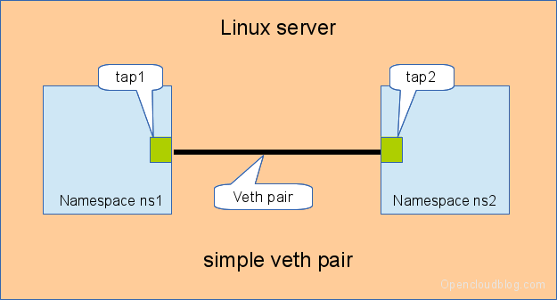
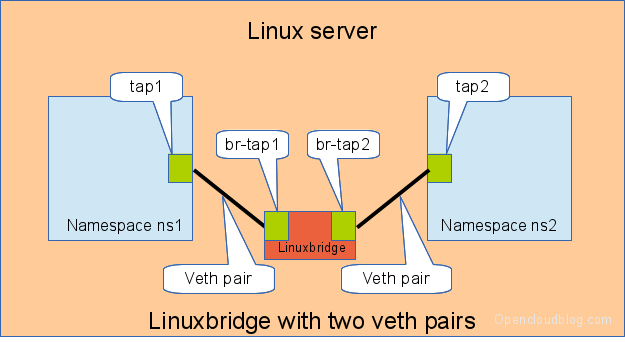

# [Linux Network Namespaces](http://www.opencloudblog.com/?p=42)

## Introduction

  In the professional networking world it is quite common to use Virtual Routing and Forwarding VRFs for a long time. Cisco, Alcatel-Lucent, Juniper and others are supporting this technology. In the L2 switching world, the concept of VLANs has been used since the 90’s of the last century. One physical switch supports more than one broadcast domain. Most switches are supporting up to 4k Vlans.

  This idea has been adopted to the L3 world. Many network devices are supporting now VRFs. This means, that more than one virtual router (Layer 3 forwarding instance) can be run on one physical device.

  In the Linux world, the VRFs of the professional networking world got the name “network namespace”. In Linux, there are other namespaces available (like mount namespace…). The acticle at http://lwn.net/Articles/531114/  has more details.

  Each network namespace has it’s own routing table, it’s own iptables setup providing nat and filtering. Linux network namespaces offer in addition the capability to run processes within the network namespace.

  But why should someone use this feature. Think about a firewall running on a Linux system. You should assign all service interfaces of the firewall to a network namespace. After this, the default network namespace and the firewall network namespace are running with different routing tables. An applications like SSH is only reachable in the default namespace but not in the firewall namespace. And you may use the same IP addresses in each namespace without any interferance – but be careful on the L2 layer!

  The following sections show the basic usage. A more complex example using also linux bridges or the openvswitch is available in this [Interconnecting Namespaces](#jintername).
  
## Basic network namespace commands

  The tool to handle network namespaces is the command ip. Some users may know this tool as the replacement for the deprecated tools ifconfig, route, netstat…. You must be root for all operations which change the configuration of the network stack.

  Mapping of the commands between the ip and the depricated tools:
```shell
ip addr
ip link set dev <interface> up/down
ip addr add <ip>/<masklen> dev <interface>
ip route
ip route add <net>/<netmasklen> via <gateway>
```
  
## Check your Linux for namespace support
  
  Before trying to play with network namespaces check it your Linux system supports network namespaces. Ubuntu 12.04 and higher versions have the feature on board.

## Creating a network namespace
```shell
#add a new namespace
ip netns add <network namespace name>
#Example:
ip netns add nstest
```
  
## Listing all existing network namespaces in the system
```shell
#list all namespaces
ip netns list
nstest
```

## Deleting a network namespace
  
  A network namespace can be deleted using the command
```shell
ip netns delete <network namespace name>
```
  
## Executing a command in a network namespace
  
  The command ip offers the “black magic” to execute commands in the network namespace. The following is used:
```shell
#execute a command in a namespace
ip netns exec <network namespace name> <command>
#Example using the namespace from above:
#shows all ip interfaces and addresses in the namespace
ip netns exec nstest ip addr
```
  A “dirty” trick is to not start each command with the prefix ip netns exec…. Start a shell in the network namespace using
```shell
ip netns exec <network namespace name> bash
```
  But do not forget, that you are now “trapped” in the network namespace. Just type exit to leave.
  
## Exploring the network namespace

  After creating the namespace with the command above, the first task is to bring up the loopback interface of the new namespace. You may have noticed from the output above, that the loopback interface is DOWN after creating the network namespace. If you forget this, strange things may happen. It’s not a good idea to leave the loopback interface down.
```shell
#set the link of lo in the namespace to up
ip netns exec nstest ip link set dev lo up
#list all interfaces and the state in the namespace 
ip netns exec nstest ip link
```
and the loopback interface is now UP. Now it’s time to connect the network namespace to the outside world.

## Adding interfaces to a network namespace
  It is not possible to assign physical interfaces of your Linux box to a network namespace. It’s only possible to attach virtual interfaces. So we have to create a virtual interface. The tool is – again – ip. The command
```shell
ip link add veth-a type veth peer name veth-b
```
creates two virtual interfaces veth-a and veth-b, which are connected using “a virtual cable”. The command ip link shows both interfaces in the default namespace.
```shell
ip link
veth-b: <BROADCAST,MULTICAST> mtu 1500 qdisc noop state DOWN mode DEFAULT qlen 1000
 link/ether 72:01:ad:c5:67:84 brd ff:ff:ff:ff:ff:ff
veth-a: <BROADCAST,MULTICAST> mtu 1500 qdisc noop state DOWN mode DEFAULT qlen 1000
 link/ether 8e:8b:bd:b1:88:e5 brd ff:ff:ff:ff:ff:ff
```
  We can now take one end of this construct and attach it to the created namespace nstest using the command
```shell
ip link set veth-b netns nstest
```
  Now ip l in the default namespace does not show this interface any more. It shows up now in the network namespace nstest, Verify this using the command
```shell
#list all interfaces in the namespace nstest
ip netns exec nstest ip link
lo: <LOOPBACK,UP,LOWER_UP> mtu 65536 qdisc noqueue state UNKNOWN mode DEFAULT 
 link/loopback 00:00:00:00:00:00 brd 00:00:00:00:00:00
veth-b: <BROADCAST,MULTICAST> mtu 1500 qdisc noop state DOWN mode DEFAULT qlen 1000
 link/ether 72:01:ad:c5:67:84 brd ff:ff:ff:ff:ff:ff
```
  Now we have two interfaces in the network namespace nstest.

## Assign ip addresses to the veth interfaces

  Now it’s time to assign ip addresses to the veth interfaces and bring the interfaces up
```shell
#default namespace
ip addr add 10.0.0.1/24 dev veth-a
ip link set dev veth-a up
#namespace nstest
ip netns exec nstest ip addr add 10.0.0.2/24 dev veth-b
ip netns exec nstest ip link set dev veth-b up
```
  Verify, that the interfaces are up (use ip link), have ip addresses assigned (use ip addr) and a route is existing (use ip route).

  Now you can ping from the default namespace interface veth-a  to the nstest namespace interface veth-b:
```shell
ping 10.0.0.2
PING 10.0.0.2 (10.0.0.2) 56(84) bytes of data.
64 bytes from 10.0.0.2: icmp_req=1 ttl=64 time=0.054 ms
64 bytes from 10.0.0.2: icmp_req=2 ttl=64 time=0.034 ms
64 bytes from 10.0.0.2: icmp_req=3 ttl=64 time=0.039 ms
64 bytes from 10.0.0.2: icmp_req=4 ttl=64 time=0.036 ms
```
  And from the nstest namespace interface veth-b to the default namespace interface veth-a:
```shell
ip netns exec nstest ping 10.0.0.1
PING 10.0.0.1 (10.0.0.1) 56(84) bytes of data.
64 bytes from 10.0.0.1: icmp_req=1 ttl=64 time=0.064 ms
64 bytes from 10.0.0.1: icmp_req=2 ttl=64 time=0.036 ms
64 bytes from 10.0.0.1: icmp_req=3 ttl=64 time=0.039 ms
```
  Try to reach another interface in the default namespace when pinging from the network namespace.

## Which software is using network namespaces?
  Network namespaces are used by many container and virtualization techniques. LXC is one of the virtualization container techniques. Openstack neutron is also using the Linux network namespaces.

  Virtual inferfaces and network namespaces are very useful, when a virtual switch, e.g. Openvswitch, is installed.  


# [Interconnecting Namespaces](http://www.opencloudblog.com/?p=66)

  Switching in software on Linux is one of the important parts when using virtualization technologies like KVM or LXC. Typical hosts do not provide one or more physical adapters for each NIC of a virtual machine in KVM or per container when using LXC. Something else must take the part to interconnect the virtual network interfaces.

  The software switching classical tool is the linuxbridge, which is available in the Linux kernel for a long time. The frontend to manage the linuxbridge is brctl. The newer tool is the Openvswitch (at http://openvswitch.org/). The main frontend is ovs-vsctl.

  In this post I will show multiple solutions to interconnect Linux namespaces using a software based switch. A performance analysis of these solutions will be discussed in another article later. Starting with network namespaces helps to understand the more complex situations when using KVM or LXC.
  
## veth pair
  The simple solution to connect two network namespaces is the usage of one veth pair. 
  
  
  
  The commands to create this setup are:
```shell
#add the namespaces
ip netns add ns1
ip netns add ns2
#create the veth pair
ip link add tap1 type veth peer name tap2
#move the interfaces to the namespaces
ip link set tap1 netns ns1
ip link set tap2 netns ns2
#bring up the links
ip netns exec ns1 ip link set dev tap1 up
ip netns exec ns2 ip link set dev tap2 up
#now assign the ip addresses
```

## linux bridge and two veth pairs
  When more than two network namespaces (or KVM or LXC instances) must be connected a switch should be used. Linux offers as one solution the well known linux bridge.
  
  
  
  We need for this setup one switch, and two connectors. In this setup we use a linuxbridge and two veth pairs.

  The commands to create this setup are:
```shell
#add the namespaces
ip netns add ns1
ip netns add ns2
#create the switch
BRIDGE=br-test
brctl addbr $BRIDGE
brctl stp   $BRIDGE off
ip link set dev $BRIDGE up
#
####PORT 1
#create a port pair
ip link add tap1 type veth peer name br-tap1
#attach one side to linuxbridge
brctl addif br-test br-tap1 
#attach the other side to namespace
ip link set tap1 netns ns1
#set the ports to up
ip netns exec ns1 ip link set dev tap1 up
ip link set dev br-tap1 up
#
####PORT 2
#create a port pair
ip link add tap2 type veth peer name br-tap2
#attach one side to linuxbridge
brctl addif br-test br-tap2
#attach the other side to namespace
ip link set tap2 netns ns2
#set the ports to up
ip netns exec ns2 ip link set dev tap2 up
ip link set dev br-tap2 up
```
