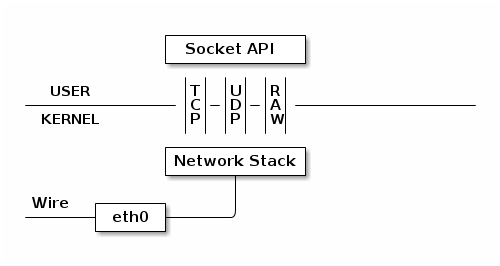
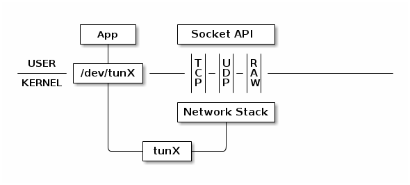

# TUN 设备
  TUN 设备是一种虚拟网络设备，通过此设备，程序可以方便得模拟网络行为。先来看看物理设备是如何工作的：
  
  
  
  所有物理网卡收到的包会交给内核的 Network Stack 处理，然后通过 Socket API 通知给用户程序。下面看看 TUN 的工作方式：
  
  
  
  普通的网卡通过网线收发数据包，但是 TUN 设备通过一个文件收发数据包。所有对这个文件的写操作会通过 TUN 设备转换成一个数据包送给内核；当内核发送一个包给 TUN 设备时，通过读这个文件可以拿到包的内容。

如果我们使用 TUN 设备搭建一个基于 UDP VPN，那么整个处理过程就是这样：

  

  数据包会通过内核网络栈两次。但是经过 App 的处理后，数据包可能已经加密，并且原有的 ip 头被封装在 udp 内部，所以第二次通过网络栈内核看到的是截然不同的网络包。

# TAP 设备
  TAP 设备与 TUN 设备工作方式完全相同，区别在于：
  * TUN 设备的 /dev/tunX 文件收发的是 IP 层数据包，只能工作在 IP 层，无法与物理网卡做 bridge，但是可以通过三层交换（如 ip_forward）与物理网卡连通。

  * TAP 设备的 /dev/tapX 文件收发的是 MAC 层数据包，拥有 MAC 层功能，可以与物理网卡做 bridge，支持 MAC 层广播
  
