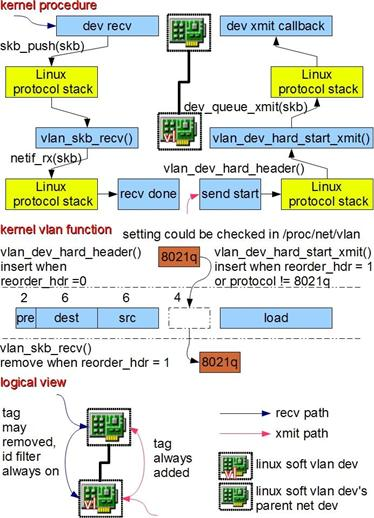

# VLAN device for 802.1.q

  VLAN 又称虚拟网络，是一个被广泛使用的概念，有些应用程序把自己的内部网络也称为 VLAN。此处主要说的是在物理世界中存在的，需要协议支持的 VLAN。它的种类很多，按照协议原理一般分为：MACVLAN、802.1.q VLAN、802.1.qbg VLAN、802.1.qbh VLAN。其中出现较早，应用广泛并且比较成熟的是 802.1.q VLAN，其基本原理是在二层协议里插入额外的 VLAN 协议数据（称为 802.1.q VLAN Tag)，同时保持和传统二层设备的兼容性。Linux 里的 VLAN 设备是对 802.1.q 协议的一种内部软件实现，模拟现实世界中的 802.1.q 交换机。

  

  Linux 里 802.1.q VLAN 设备是以母子关系成对出现的，母设备相当于现实世界中的交换机 TRUNK 口，用于连接上级网络，子设备相当于普通接口用于连接下级网络。当数据在母子设备间传递时，内核将会根据 802.1.q VLAN Tag 进行对应操作。母子设备之间是一对多的关系，一个母设备可以有多个子设备，一个子设备只有一个母设备。当一个子设备有一包数据需要发送时，数据将被加入 VLAN Tag 然后从母设备发送出去。当母设备收到一包数据时，它将会分析其中的 VLAN Tag，如果有对应的子设备存在，则把数据转发到那个子设备上并根据设置移除 VLAN Tag，否则丢弃该数据。在某些设置下，VLAN Tag 可以不被移除以满足某些监听程序的需要，如 DHCP 服务程序。举例说明如下：eth0 作为母设备创建一个 ID 为 100 的子设备 eth0.100。此时如果有程序要求从 eth0.100 发送一包数据，数据将被打上 VLAN 100 的 Tag 从 eth0 发送出去。如果 eth0 收到一包数据，VLAN Tag 是 100，数据将被转发到 eth0.100 上，并根据设置决定是否移除 VLAN Tag。如果 eth0 收到一包包含 VLAN Tag 101 的数据，其将被丢弃。上述过程隐含以下事实：对于寄主 Linux 系统来说，母设备只能用来收数据，子设备只能用来发送数据。和 Bridge 一样，母子设备的数据也是有方向的，子设备收到的数据不会进入母设备，同样母设备上请求发送的数据不会被转到子设备上。可以把 VLAN 母子设备作为一个整体想象为现实世界中的 802.1.q 交换机，下级接口通过子设备连接到寄主 Linux 系统网络里，上级接口同过主设备连接到上级网络，当母设备是物理网卡时上级网络是外界真实网络，当母设备是另外一个 Linux 虚拟网络设备时上级网络仍然是寄主 Linux 系统网络。
需要注意的是母子 VLAN 设备拥有相同的 MAC 地址，可以把它当成现实世界中 802.1.q 交换机的 MAC，因此多个 VLAN 设备会共享一个 MAC。当一个母设备拥有多个 VLAN 子设备时，子设备之间是隔离的，不存在 Bridge 那样的交换转发关系，原因如下：802.1.q VLAN 协议的主要目的是从逻辑上隔离子网。现实世界中的 802.1.q 交换机存在多个 VLAN，每个 VLAN 拥有多个端口，同一 VLAN 端口之间可以交换转发，不同 VLAN 端口之间隔离，所以其包含两层功能：交换与隔离。Linux VLAN device 实现的是隔离功能，没有交换功能。一个 VLAN 母设备不可能拥有两个相同 ID 的 VLAN 子设备，因此也就不可能出现数据交换情况。如果想让一个 VLAN 里接多个设备，就需要交换功能。在 Linux 里 Bridge 专门实现交换功能，因此将 VLAN 子设备 attach 到一个 Bridge 上就能完成后续的交换功能。总结起来，Bridge 加 VLAN device 能在功能层面完整模拟现实世界里的 802.1.q 交换机。
